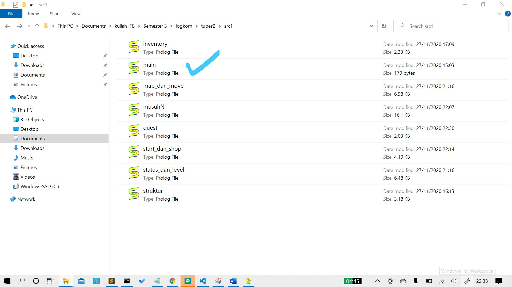
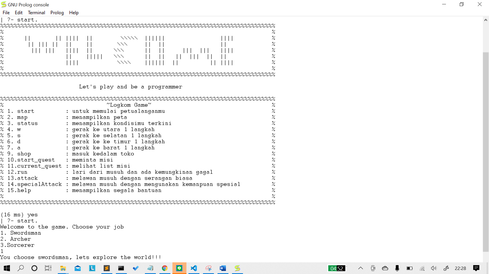

# Permaian Logkom Bahasa Prolog
Sebuah project permaian survival yang dibuat untuk memenuhi tugas besar matakuliah IF2121 Logika komputasional ITB dengan bahasa prolog.

## Daftar ISI
[Daftar Command](#daftar-command)\
[Menjalankan Program](#menjalankan-program)\
[Menjalankan Permainan](#menjalankan-permaian)\
[Hal Lain yang Menarik Dibahas](#hal-lain-yang-menarik-dibahas)\

## Daftar Command
 %%%%%%%%%%%%%%%%%%%%%%%%%%%%%%%%%%%%%%%%%%%%%%%%%%%%%%%%%%%%%%%%%%%%%%%%%%%
 
1. start.        : untuk memulai petualanganmu                              
2. map.          : menampilkan peta                                        
3. status.       : menampilkan kondisimu terkini                         
4. w.            : gerak ke utara 1 langkah                               
5. s.            : gerak ke selatan 1 langkah                           
6. d.            : gerak ke ke timur 1 langkah
7. a.            : gerak ke barat 1 langkah
9. shop.         : masuk kedalam toko            
10.start_quest.  : meminta misi
11.current_quest.: melihat list misi
12.run.          : lari dari musuh dan ada kemungkinan gagal
13.attack.       : melawan musuh dengan serangan biasa 
14.specialAttack.: melawan musuh dengan mengunakan kemanpuan spesial
15.help.         : menampilkan segala bantuan 
 
 %%%%%%%%%%%%%%%%%%%%%%%%%%%%%%%%%%%%%%%%%%%%%%%%%%%%%%%%%%%%%%%%%%%%%%%%%%%%

## Menjalankan Program
pindah ke directory yang sesuai dengan file berada
masuk ke file src
jalankan main.pl

## Menjalankan Permaian  
Setelah menjalankan program command yang bisa digunakan hanya command start. .
jalankan command start. sebanyak 2 kali untuk massuk ke permaian dan memilih kareakter yang ada.

Semua command didaftar command bisa dijalankan kecuali beberapa command berikut yang memerlukan syarat:
 1. shop. pemian berada di titik S berada.
 2. start_quest. pemain berada di Q.  
 3. attack. ketika bertemu musuh.
 4. specialAttack. ketika sudah melakukan 3 kali attack.
 5. Command Move (w. , s., d. , a.) dapat digunakan ketika tidak dalam mode bertarung dan perubahan pergerkan tidak di pagar.

## Hal Lain yang Menarik Dibahas
 1. Kemunculan musuh (goblin, slime ,woft) secara random dengan 10% kemungkian muncul disetiap pergerakan pemain dan diharapkan sering mengunakan usePointion.
 2. Level Up akan terjadi ketika EXP mencapai max EXP level.
 3. Game Over ketiak kamu kalah dari BOSS sang Dragon (D). 
 4. Setelah menyelesaikan tantangan EXP bertambah.                

